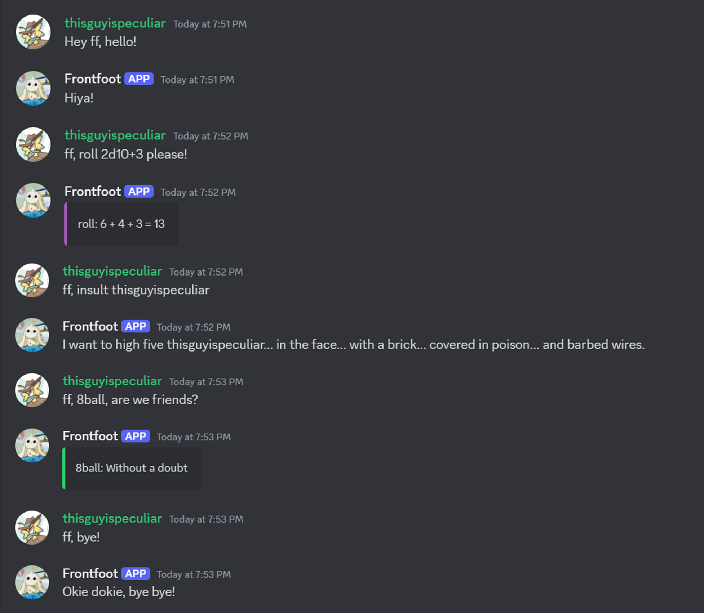

<div align="center">
  <h1 align="center">Frontfoot-Discord-Bot</h1>
<p align="center">

[](https://discord.com/oauth2/authorize?client_id=1175204727500312616)

</p>

<p align="center">
    Frontfoot is a fun bot for your personal Discord servers with chat commands, dice rolling, magic 8 ball, interactive menu, minigames and more. This bot is in active development and hosted via a free service so be on the lookout for new features. If you enjoy having Frontfoot in your server, don't forget to give this repository a star! ⭐
</p>

</div>


<!-- ABOUT THE PROJECT -->

## 》Features
- [x] Various text-based commands
- [x] Roll a dice for bets & games
- [x] Consult the magic 8-ball
- [x] Enjoy a round of blackjack
- [x] Try your hands at RPS 
- [x] Responds to 'i love you'


## 》Screenshots
<div>
    <br /><br />
</div>

## 》Contribution


Fork and clone the repository.
```bash
git clone https://github.com/VibhorAgrawal2003/Frontfoot-Discord-Bot.git
```

After cloning, copy `.env_sample` to `.env` and fill the values (you will need access to discord devportal), then run the following command in project's root directory to start the bot.

```bash
python3 main.py
```

To add a new feature, please create a separate branch first. After completion with testing, commit changes and create a Pull Request. Feel free to ping me on Discord afterwards. Cheers!

```bash
git branch new_feature_name
git checkout new_feature_name
git commit -m "add <describe feature>"
git push origin new_feature_name
```


## 》Queries

> I added Frontfoot to my Discord server but he is offline. What to do?
-The bot is likely down for maintenance, give it some time, if the issue persists, contact me on Discord @thisguyispeculiar.
